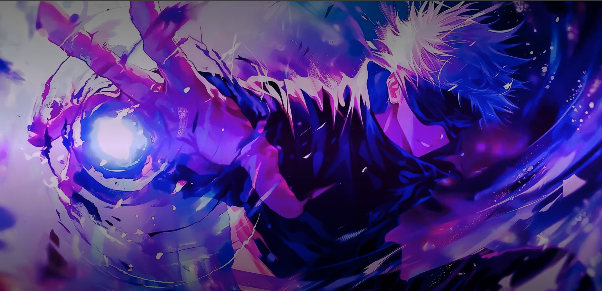

# 🌸 Manga Heroes — Landing Page Animée 2025

Une landing page immersive inspirée des univers manga, anime et shonen.  
Idéale pour présenter un projet, un portfolio, une communauté ou un événement autour de la pop culture japonaise.

> ✨ **Design ultra-moderne**, animations 3D, navigation smooth, responsive, effet “waouh” garanti.

---

## 🚀 Démo en ligne

🖥️ [Voir la démo (Netlify)](https://manga-theme.netlify.app/)

---

## 🎨 Aperçu



---

## ⚡️ Fonctionnalités principales

- **Hero animé** avec vidéo immersive et overlay dynamique
- **Section “Le Cercle des Héros”** : carousel 3D interactif avec personnages iconiques (One Piece, DBZ, JJK…)
- **Timeline / Programme** illustré (étapes, progression)
- **Formulaire de contact** animé et accessible
- **Menu magique** qui apparaît après le Hero, inspiré des UI de Genshin Impact
- **Responsive complet** : PC, tablette, mobile
- **Effets premium** : gradients, ombres, transitions douces, curseur custom, etc.

---

## 🛠 Stack technique

- **React + TypeScript**
- **Vite**
- **Tailwind CSS**
- **Framer Motion**
- **Custom GSAP/JS pour certaines animations**
- Aucune dépendance inutile

---

## 🚚 Installation & lancement

1. **Cloner le repo**
   ```bash
   git clone https://github.com/yassinkh2025/manga-theme
   cd manga-heroes-landing


# 🌸 Manga Heroes — Landing Page Animée 2025

Une landing page immersive inspirée des univers manga, anime et shonen.  
Idéale pour présenter un projet, un portfolio, une communauté ou un événement autour de la pop culture japonaise.

> ✨ **Design ultra-moderne**, animations 3D, navigation smooth, responsive, effet “waouh” garanti.

---

## 🚀 Démo en ligne

🖥️ [Voir la démo (Netlify)](https://tonlien.netlify.app)

---

## 🎨 Aperçu


---

## ⚡️ Fonctionnalités principales

- **Hero animé** avec vidéo immersive et overlay dynamique
- **Section “Le Cercle des Héros”** : carousel 3D interactif avec personnages iconiques (One Piece, DBZ, JJK…)
- **Timeline / Programme** illustré (étapes, progression)
- **Formulaire de contact** animé et accessible
- **Menu magique** qui apparaît après le Hero, inspiré des UI de Genshin Impact
- **Responsive complet** : PC, tablette, mobile
- **Effets premium** : gradients, ombres, transitions douces, curseur custom, etc.

---

## 🛠 Stack technique

- **React + TypeScript**
- **Vite**
- **Tailwind CSS**
- **Framer Motion**
- **Custom GSAP/JS pour certaines animations**
- Aucune dépendance inutile

---

## 🚚 Installation & lancement

1. **Cloner le repo**
   ```bash
   git clone https://github.com/yassinkh2025/manga-theme
   cd manga-heroes-landing

Installer les dépendances

bash
Copier
Modifier
npm install
# ou yarn


Lancer en local

bash
Copier
Modifier
npm run dev

Modifier les images ou personnages

Place tes images dans /public/

Change les données dans Carousel3D.tsx

📁 Structure des fichiers
src/Hero.tsx — Section d’intro vidéo

src/Carousel3D.tsx — Carousel “Héros” 3D

src/Program3D.tsx — Timeline étapes / progression

src/Contact3D.tsx — Formulaire contact stylé

src/Menu.tsx — Menu magique flottant animé

src/App.tsx — Structure principale

src/Footer.tsx - Footer


✨ Crédits & inspiration
Illustrations issues de banques d’images libres de droits / prompts AI

Animation et style inspirés par Genshin Impact, One Piece, JJK, DBZ

Design et intégration réalisés par TonPseudo

📜 Licence
Template libre de droits pour usage personnel et non-commercial.


Enjoy & partage la magie manga !